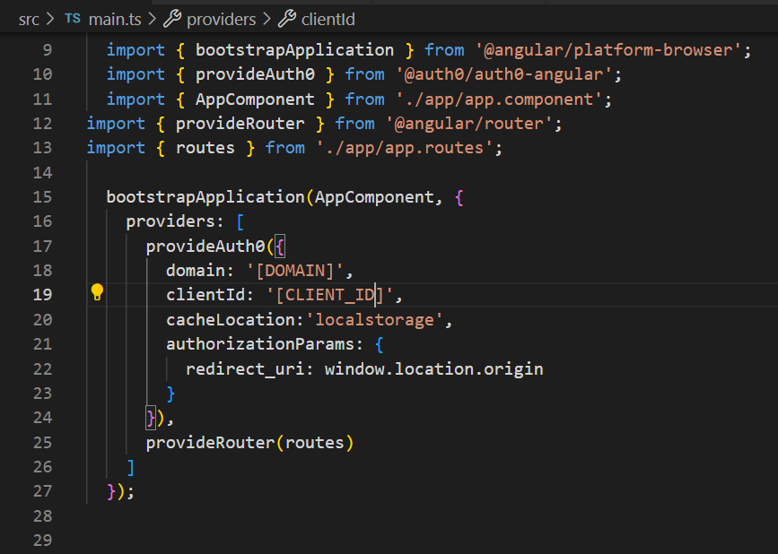
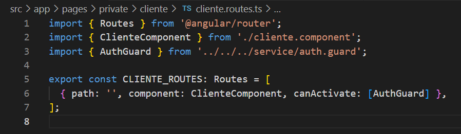

# Auth0
Auth0 es una plataforma de autenticación y autorización como servicio (Identity-as-a-Service o IDaaS) que permite a los desarrolladores agregar de forma rápida y segura capacidades de autenticación a sus aplicaciones. Auth0 se encarga de la gestión de identidades, autenticación de usuarios (inicios de sesión), autorización (permisos y roles), así como de la implementación de protocolos estándar como OAuth2.0, OpenID Connect y SAML.

Entre sus funcionalidades principales están:

- Autenticación: Soporta múltiples métodos de autenticación, como inicio de sesión con correo y contraseña, autenticación social (Google, Facebook, etc.), y autenticación multifactor (MFA).
- Autorización: Permite definir roles y permisos para controlar lo que cada usuario puede hacer en una aplicación.
Gestión de usuarios: Ofrece un panel para gestionar usuarios, revisar sus perfiles, cambiar contraseñas, bloquear cuentas, entre otras funcionalidades.
- Seguridad: Proporciona medidas de seguridad avanzadas, como el cifrado de tokens JWT, gestión de sesiones y protección contra ataques como el fraude de identidades.
Auth0 se utiliza ampliamente porque simplifica mucho el proceso de implementación de seguridad en aplicaciones, sin necesidad de desarrollar estos sistemas desde cero.

## Instalacion
```npm install @auth0/auth0-angular```

## Editar el archivo main.ts

Agregar el siguiente codigo  

```typescript
provideAuth0({
    domain: 'dev-vxlntca4ks00fqdt.us.auth0.com',
    clientId: '4LteZiRMQJXhvDCNsjfV4N4pcDjkw7kI',
    cacheLocation:'localstorage',
    authorizationParams: {
        redirect_uri: window.location.origin
    }
})
```


Es buena practiva localstorage para no estar llamando continuamente al servico de auth0, como asi tambien variables de entornos.


## Forma de utlizacion 
En el componente o servicio que necesites usarlo agregarlo como parametro de la siguiente manera
```typescript
constructor(public auth: AuthService){
    this.auth.idTokenClaims$.subscribe(
        data => { 
            console.log(data);
        })
  }
```

Este codigo tendra un objeto con los valores:

- email
- email_verified (si esta verificado no )
- exp (expracion de la session)
- family_name (apellido)
- given_name (nombre)
- name (nombre y apellido)
- nickname 
- picture 
- __raw (JWT)

### Implementacion
Para no validar en cada uno de los componente lo que se realiza es diretamente un utilizar un guard que se va a colocar en cada uno de los ROUTES que necesiten ser privados.


Configurando el canActivate no permitira configurar un escuchador donde 


- `AuthGuard`: es utilizada para proteger rutas dentro de una aplicación. 
- `CanActivate`: permite o denega el acceso a una ruta dependiendo de condiciones específicas, como si el usuario está autenticado o tiene ciertos permisos.

Cuando se usa `AuthGuard` con `CanActivate`, se intercepta la navegación hacia una ruta y se verifica si el usuario tiene permiso para acceder a ella. Si la condición definida en el guard es `true`, el usuario puede acceder a la ruta; si es `false`, la navegación es bloqueada.

## Definición básica de `CanActivate`:

`CanActivate` es una interfaz que define un único método, `canActivate()`. Este método debe devolver un valor de tipo `boolean`, `Observable<boolean>`, o `Promise<boolean>`. Si el valor es `true`, se permite la navegación; si es `false`, se deniega.

### 1. Crear el guard (`AuthGuard`):
Utiliza Angular CLI para generar un guard.

```bash
ng generate guard auth
```
### 2. Definir el guard en el archivo auth.guard.ts:


### 3. Proteger rutas con canActivate en el archivo de rutas :
